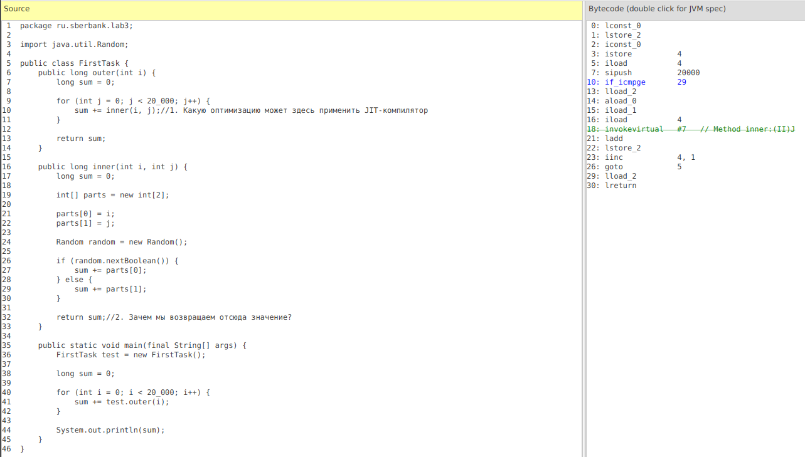
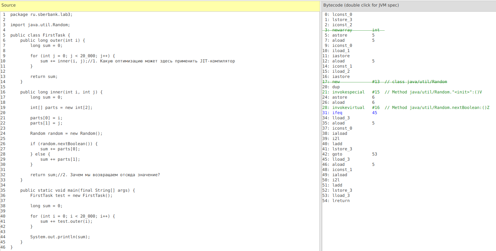
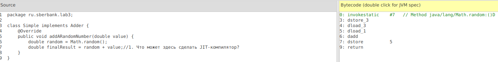
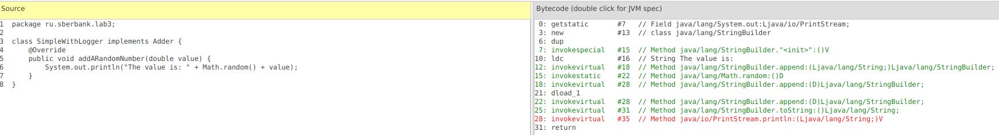
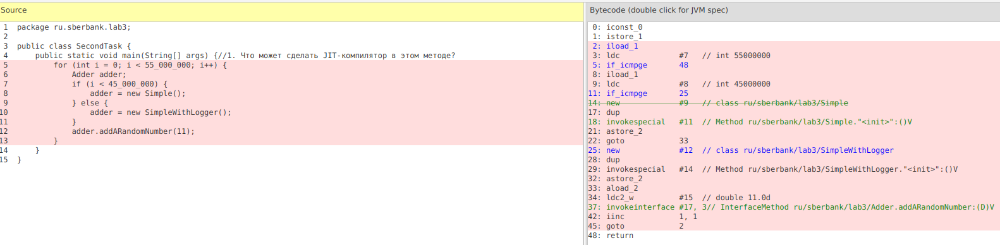

## Optimization lab3
#### Александр Кирильченко

#### FirstTask.outer()
Notes:
* Будем рассматривать по возможности режим компиляции С2
* Рассматриваем только последнюю по timestamp компиляцию, менее подробно рассматриваем предыдущие

| BCodeOp | RelativeSource | Optimization | Comp | Explanation & Reasons
| -------- | ------------- | ------------ | ---- | -------- 
|  3: if_icmpge | 9: for (...) | Trap, Deoptimization (?) | C2 | После С2 компиляции на основании профиля JIT видит, что branch-переходы не соответствуют ожиданиям, данный участок выполняется неоптимально, и к нему можно применить деоптимизацию и перекомпиляцию
| 18: invokevirtual | 10: inner(i, j) | Inlining | C2 | (ответ на вопрос #1) JIT заменяет вызов функции на ее содержимое, тк видит, что фция выполняется много раз и имеет небольшой размер, экономим jump-командами и обращениями к стеку. Причем, при C1-компиляции оптимизация не применилась из-за большого размера байт кода фции (Jitwatch: callee is too large) 

#### FirstTask.inner()

| BCodeOp | RelativeSource | Optimization | Comp | Explanation & Reasons
| -------- | ------------- | ------------ | ---- | --------
|  3: newarray | 19: int[] parts = new int[2] | EscapeAnalysis, Inlining | C2 | JIT видит, что обьект parts[] не покидает своего scope, и компилирует код так, чтобы этот обьект (или всего лишь его значимые кусочки) аллоцировался в стек вместо heap 
| 17: new | 24: new Random() | EscapeAnalysis, Inlining | C2 | Аналогично с предыдущим. EscapeAnalysis производится только в режиме С2 
| 21: invokespecial | 24: new Random() | Inlining | C2 and C1 | Здесь производится inlining конструктора класса Random(), конструктор относится к тн SpecialMethods, поэтому invokespecial
| 28: invokevirtual | 26: random.nextBoolean() | Inlining |  C1 and C2 | Аналогично предыдущему
| 21: ifeq | if (random.nextBoolean()) | Deoptimization (?) |  C1 and C2 | Аналогично случаю с if_icmpge

#### SecondTask

#### SecondTask.Simple.addRandomNumber()

| BCodeOp | RelativeSource | Optimization | Comp | Explanation & Reasons
| -------- | ------------- | ------------ | ---- | -------- 
| 0: invokestatic | 6: Math.random() | Inlining / DeadCodeElimination? | C2 | (ответ на вопрос #1) По идее здесь JIT должен увидеть dead code и как-то избавиться от вызова random(), но почему-то он не делает этого, хотя я пробовал значительно увеличить кол-во итераций (или это не видит Jitwatch?).

#### SecondTask.SimpleWithLogging.addRandomNumber()

| BCodeOp | RelativeSource | Optimization | Comp | Explanation & Reasons
| -------- | ------------- | ------------ | ---- | -------- 
| 7:, 12:, ... invoke(...) | Math.random(), StringBuilder.append() | Inlining | C1 | Здесь уже не может быть dead code, так как метод пишет данные в поток. В данном случае JIT лишь выполняет Inlining всех методов из-за частых обращений (Jitwatch: inline (hot))
| 28: invokevirtual | printStream.println() | Inlining failure | C1 |  Код скомпилирован, но Inlining не удался, Callee is too large

#### SecondTask.SecondTask.main()

| BCodeOp | RelativeSource | Optimization | Comp | Explanation & Reasons
| -------- | ------------- | ------------ | ---- | -------- 
| 2:, 5:, 11: if_icmp, iload | 5: for(...), 7: if (...), 25: new() | Deoptimization warnings | C2| Сообщения о том, что скомпилированный код выполняется в несоответствии с ожиданиями и может быть деоптимизирован/ перекомпилирован, причины - Uncommon traps: 1) JIT на основании профиля скомпилировал лишь 1 branch, а мы начали часто попадать в другой, как раз такая ситуация с нашим циклом (5: - 7:), 2) Мы вначале долго и часто пользуемся только классом Simple (и он заинлайнился), а класс SimpleWithLogger за это время удалился из compiled code cache, и при обращении к нему будет использоваться уже байт-код (пример деоптимизации)
| 28: invokeinterface | 12: adder.addRandomNumber() | Inlining, implementation prediction(?) | C2 | JIT видит, что вызов метода интерфейса осуществляется из под одного и того же класса (Simple), заменяет вызов интерфейса на вызов конркретного класса и инлайнит его